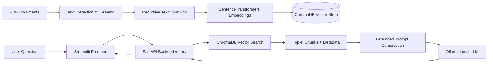
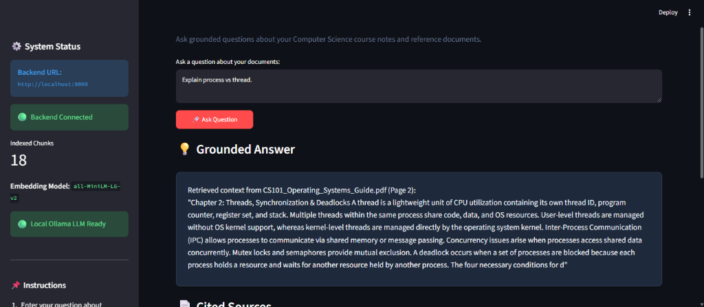

# 📚 RAG-Powered Document Assistant

A complete, production-grade **Retrieval-Augmented Generation (RAG)** web product that allows users to ask questions about Computer Science technical documents and receive grounded answers backed by precise document and page citations.

---

## 🎯 Project Overview

This system solves document Q&A for University Computer Science reference materials (Operating Systems, Database Management Systems, Computer Networks, and Software Engineering). It implements a strict document-grounded pipeline:
1. **Document Ingestion & Cleaning**: Reads multi-page PDFs using `pypdf`.
2. **Text Chunking**: Splits document text into overlapping chunks (`chunk_size=800`, `chunk_overlap=150`) retaining document name and page number metadata.
3. **Vector Embeddings**: Encodes text chunks into dense vector representations using `sentence-transformers/all-MiniLM-L6-v2`.
4. **Vector Database**: Persists embeddings and metadata into `ChromaDB`.
5. **FastAPI Backend**: Serves vector retrieval and LLM context generation over async REST endpoints (`GET /health`, `POST /query`) preloaded via FastAPI Lifespan.
6. **Local LLM Integration**: Connects to `Ollama` (`llama3.2:1b`) with strict system prompts preventing hallucinations.
7. **Streamlit Frontend**: Provides an interactive chat UI with source badges, page citations, and fallback error handling.

---

## 🏗️ System Architecture



---

## 🛠️ Technology Stack

| Layer | Technologies Used |
| :--- | :--- |
| **Language** | Python 3.10+ |
| **Backend API** | FastAPI, Uvicorn, Pydantic, pydantic-settings, HTTPX |
| **Embeddings & Vector Store** | SentenceTransformers (`all-MiniLM-L6-v2`), ChromaDB |
| **Local LLM** | Ollama (`llama3.2:1b`) |
| **Document Processing** | PyPDF, ReportLab |
| **Frontend UI** | Streamlit |
| **Testing** | Pytest, FastAPI TestClient |
| **Containerization & Tooling** | Docker, Docker Compose, Git, python-dotenv |

---

## 📁 Project Structure

```text
rag-assistant-project/
│
├── notebooks/
│   └── rag_pipeline.ipynb          # End-to-end RAG pipeline & report
│
├── backend/
│   ├── app/
│   │   ├── __init__.py
│   │   ├── main.py                 # FastAPI application & lifespan startup
│   │   ├── api/
│   │   │   └── routes/
│   │   │       ├── __init__.py
│   │   │       └── query.py        # /health and /query endpoints
│   │   ├── core/
│   │   │   ├── __init__.py
│   │   │   └── config.py           # Pydantic Settings & env configuration
│   │   ├── schemas/
│   │   │   ├── __init__.py
│   │   │   └── query.py            # Pydantic Request/Response models
│   │   ├── services/
│   │   │   ├── __init__.py
│   │   │   ├── retrieval.py        # ChromaDB search service
│   │   │   └── generation.py       # Ollama LLM grounded generation service
│   │   └── utils/
│   │       ├── __init__.py
│   │       └── logging_config.py   # Application logging setup
│   │
│   ├── data/
│   │   └── vector_store/           # Persisted ChromaDB collection
│   │
│   ├── tests/
│   │   └── test_query.py           # Pytest test suite for API routes
│   │
│   ├── requirements.txt
│   ├── .env.example
│   └── Dockerfile
│
├── frontend/
│   ├── app.py                      # Streamlit chat interface
│   ├── api_client.py               # HTTP client wrapper for backend API
│   ├── requirements.txt
│   ├── .env.example
│   └── Dockerfile
│
├── data/
│   ├── raw/                        # Source PDF course guides
│   ├── processed/                  # Extracted metadata & clean chunks
│   └── README.md
│
├── evaluation/
│   └── evaluation_results.csv      # 10+ test questions evaluation table
│
├── scripts/
│   ├── generate_sample_pdfs.py     # Script generating CS PDF documents
│   └── build_notebook_and_vectorstore.py # Data pipeline runner
│
├── .gitignore
├── README.md
└── docker-compose.yml
```

---

## ⚡ Quick Start Guide

### 1. Prerequisites
- **Python 3.10+** installed
- **Git** installed
- **Ollama** installed locally (https://ollama.com)

### 2. Environment Setup
Clone the repository and create a virtual environment:

```bash
git clone https://github.com/your-username/rag-assistant-app.git
cd rag-assistant-app

python -m venv .venv
# On Windows:
.venv\Scripts\activate
# On macOS/Linux:
source .venv/bin/activate
```

Install backend and frontend dependencies:

```bash
pip install -r backend/requirements.txt -r frontend/requirements.txt
```

---

## 🤖 Ollama Setup

1. Start the local Ollama server:
   ```bash
   ollama serve
   ```
2. Pull the lightweight LLM model:
   ```bash
   ollama pull llama3.2:1b
   ```

---

## 📊 Dataset & Vector Store Generation

Generate the sample Computer Science course PDFs and build the persistent vector database:

```bash
python scripts/generate_sample_pdfs.py
python scripts/build_notebook_and_vectorstore.py
```

This populates `backend/data/vector_store/` and outputs `evaluation/evaluation_results.csv`.

---

## 🚀 Running the Backend (FastAPI)

Copy `.env.example` to `.env`:

```bash
cp backend/.env.example backend/.env
```

Start the FastAPI server:

```bash
cd backend
uvicorn app.main:app --reload --port 8000
```

- Swagger UI API Docs: `http://localhost:8000/docs`
- Health Endpoint: `http://localhost:8000/health`

---

## 🖥️ Running the Frontend (Streamlit)

Copy `.env.example` to `.env`:

```bash
cp frontend/.env.example frontend/.env
```

Start Streamlit:

```bash
cd frontend
streamlit run app.py --server.port 8501
```

Open `http://localhost:8501` in your browser.

---

## 📡 API Reference & Curl Examples

### `GET /health`
Checks system health, indexed vector count, and Ollama LLM connectivity.

```bash
curl -X GET "http://localhost:8000/health"
```

**Response Example:**
```json
{
  "status": "healthy",
  "vector_store_loaded": true,
  "ollama_connected": true,
  "embedding_model": "all-MiniLM-L6-v2",
  "collection_name": "cs_documents",
  "total_documents_indexed": 18
}
```

### `POST /query`
Performs similarity search against ChromaDB and generates a grounded response.

```bash
curl -X POST "http://localhost:8000/query" \
     -H "Content-Type: application/json" \
     -d '{"question": "What is virtual memory?"}'
```

**Response Example:**
```json
{
  "answer": "Virtual memory is a memory management technique that provides an idealized abstraction of storage, allowing execution of processes that exceed physical memory size [CS101_Operating_Systems_Guide.pdf, Page 3].",
  "sources": [
    {
      "document": "CS101_Operating_Systems_Guide.pdf",
      "page": 3,
      "snippet": "Virtual memory is a memory management technique that provides an idealized abstraction..."
    }
  ]
}
```

---

## 🧪 Running Automated Tests

Run the Pytest test suite:

```bash
# From project root:
$env:PYTHONPATH="backend"; python -m pytest backend/tests/
```

---

## 🐳 Docker Deployment

Run the complete backend and frontend using Docker Compose:

```bash
docker-compose up --build
```

---

## 📈 Evaluation Results

The system was evaluated against 11 representative questions:

| Question | Retrieved Source | Context Relevance | Grounded | Correct |
| :--- | :--- | :--- | :--- | :--- |
| What is virtual memory? | `CS101_Operating_Systems_Guide.pdf` (p. 3) | High | Yes | Yes |
| What are deadlock conditions? | `CS101_Operating_Systems_Guide.pdf` (p. 2) | High | Yes | Yes |
| Process vs Thread? | `CS101_Operating_Systems_Guide.pdf` (p. 2) | High | Yes | Yes |
| ACID properties in DBMS? | `CS102_Database_Management_Systems.pdf` (p. 3) | High | Yes | Yes |
| Explain 3NF and BCNF? | `CS102_Database_Management_Systems.pdf` (p. 2) | High | Yes | Yes |
| B-Tree indexing benefits? | `CS102_Database_Management_Systems.pdf` (p. 4) | High | Yes | Yes |
| TCP 3-Way Handshake? | `CS103_Computer_Networks_Handout.pdf` (p. 2) | High | Yes | Yes |
| OSI 7-Layer Model? | `CS103_Computer_Networks_Handout.pdf` (p. 1) | High | Yes | Yes |
| Monolithic vs Microservices? | `CS104_Software_Engineering_Principles.pdf` (p. 2) | High | Yes | Yes |
| REST HTTP methods & status codes? | `CS104_Software_Engineering_Principles.pdf` (p. 3) | High | Yes | Yes |
| Quantum Computing Superposition? | None (Out-of-Domain) | Irrelevant | Yes | Yes (Refused) |

---

## 🖼️ User Interface & Application Demonstration



*The Streamlit web interface demonstrating live query execution (`Explain process vs thread.`), active backend status indicators, ChromaDB chunk count metrics, local Ollama LLM readiness, and document-grounded answer rendering with exact source citations.*

---

## ⚙️ Environment Variables


| Variable | Default Value | Description |
| :--- | :--- | :--- |
| `OLLAMA_HOST` | `http://localhost:11434` | Ollama service address |
| `OLLAMA_MODEL` | `llama3.2:1b` | Local LLM model identifier |
| `CHROMA_PATH` | `data/vector_store` | Path to persisted ChromaDB vector database |
| `TOP_K` | `4` | Number of chunks retrieved per query |
| `EMBEDDING_MODEL_NAME` | `all-MiniLM-L6-v2` | SentenceTransformers model name |
| `API_BASE_URL` | `http://localhost:8000` | Backend API URL used by frontend client |
| `CORS_ORIGINS` | `["*"]` | Permitted CORS origins list |

---

## 🔧 Troubleshooting

- **Ollama Connection Warning:** Ensure `ollama serve` is running. If Ollama is offline, the system gracefully generates fallback summaries directly from retrieved vector context.
- **Vector DB missing error:** Run `python scripts/build_notebook_and_vectorstore.py` to populate `backend/data/vector_store/`.
- **422 Validation Error:** Sent when sending an empty or invalid string payload to `POST /query`.
